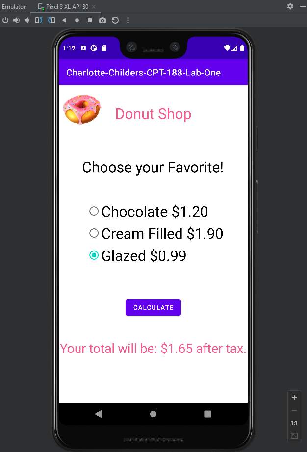

# CPT-188 Android Programming (Kotlin)
## Charlotte Childers

This project is apart of the Spartanburg Community College Android Programming
Class. 

---

This app is a donut shop app-let, the purpose is to allow the user to select
a donut from a list of radio buttons.

Price values are assigned to the radio buttons via a [when expression](https://kotlinlang.org/docs/control-flow.html#when-expression)


```kotlin
when {
    glazed.isChecked -> {
        price = 0.99
    }
    choco.isChecked -> {
        price = 1.20
    }
    cream.isChecked -> {
        price = 1.90
    }
    else -> {
        toast.show()
    }
}
```

---

### This Code Demonstrates:

- Simple Error checking
- Design capability
- Thoughtful usage of expression and assignments
- Thoughtful use of error messages for the user


I Allocated 6gb of my 32gb RAM for the Emulator - anything less and startup seems to be quite slow.

